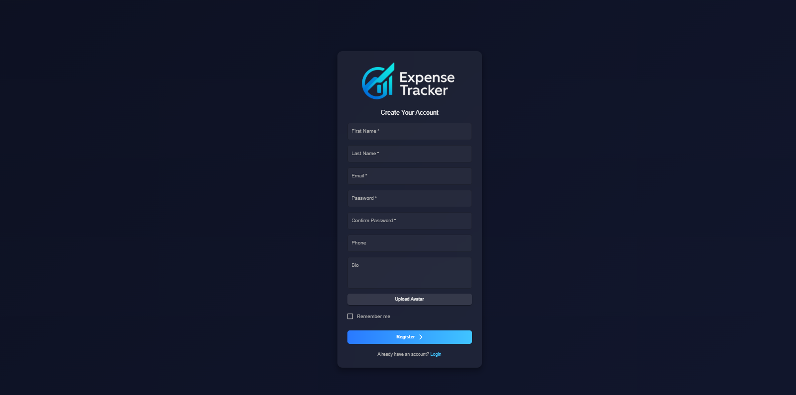

# ExpenseTracker — Full-Stack React/Laravel aplikacija za budžetiranje i lične finansije

**ExpenseTracker** je moderna SPA (Single Page Application) za planiranje troškova, vođenje ličnih finansija i kolaboraciju kroz štedne grupe. Frontend je razvijen u **React** + **Vite** + **MUI**, a backend u **Laravelu** (API + Sanctum autentikacija). U sklopu aplikacije postoje napredne analitike (Recharts), administrativni modul, kao i “grupe” sa chat-om i pretragom članova.

> **Tehnički pregled**
>
> - **Frontend:** React, React Router, Axios (interceptor za Bearer token), MUI (Material UI), Recharts  
> - **Backend:** Laravel 10/11, Sanctum, Eloquent, Resource klasa, Form Request validacije  
> - **Autentikacija:** Token (Sanctum, `Authorization: Bearer <token>`) + CORS  
> - **UI/UX:** tamna tema, responzivan dizajn, kartice i dijalozi, role-based meni  
> - **Grafikoni:** Bar/Area/Donut (Recharts)  
> - **Dodatno:** CSV eksport, News widget (Spaceflight News API – bez API ključa), e-mail slanje sa javnim webhook servisom (npr. FormSubmit/MailThis – bez ključa)

---

## Funkcionalnosti

- **Prijava/registracija** sa upload-om avatara (npr. ImgBB).
- **Troškovi (Expenses):** kreiranje, izmena, brisanje, filtriranje, paginacija.
- **Mesečni izveštaji o štednji (Savings Reports):**
  - pregled po mesecima,
  - analitika (broj stavki, suma, prosek, *by category*),
  - pregled stavki iz izveštaja.
- **Štedne grupe (Groups):**
  - kreiranje/join/leave,
  - vlasnik (owner) može uređivati/brisati grupu,
  - pretraga korisnika po imenu/email-u uz prikaz avatara i statusa (zelena/siva tačka),
  - chat u okviru grupe.
- **Admin modul:**
  - globalna statistika za sve korisnike (Top meseci, trend poslednjih 12 meseci),
  - upravljanje korisnicima sa rolom *regular* (lista, pretraga, brisanje),
  - izvoz korisnika u CSV.
- **News widget** (besplatni javni API) sa sliderom kartica i slikama.
- **Role-based navigacija** i zaštita ruta (SPA guard).

---

## Korisničke uloge i prava

### 1) Neulogovani korisnik
- Može da pristupi **/ (login)** i **/register**.
- Nema uvid u podatke niti API pozive pod auth middleware-om.
- Posle uspešne prijave session se čuva u `sessionStorage` (`token`, `user`).

### 2) Regularan korisnik
- Pristupa **Home**, **Track Expenses**, **Savings Reports**, **My Savings Groups**.
- **Troškovi:** pun CRUD i sortiranja/filtriranja.
- **Izveštaji:** pravljenje mesečnih izveštaja, analitika i pregled stavki.
- **Grupe:** kreiranje (postaje *owner*), učlanjenje/napuštanje; *owner* može edit/ delete; chat dostupnan samo članovima.
- **Vidljivost dugmadi u grupama:** „Members/Chat“ su skriveni dok korisnik ne postane član.
- Nema pristup admin modulima.

### 3) Administrator
- Posle logovanja preusmerava se na **/admin-dashboard**.
- Vidi linkove: **Admin Dashboard** i **Users Management**.
- **Admin Dashboard:** globalne statistike (Top 8 meseci po sumi, trend 12 meseci, KPI čipovi); widget za najnovije vesti; dugme za slanje izveštaja na e-mail.
- **Users Management:** lista *regular* korisnika, pretraga, brisanje, CSV eksport.
- Nema manipulaciju tuđim ličnim podacima mimo navedenog.

---

## Stranice i UI moduli

- **Auth.jsx** – Login/Registracija, upload avatara, role-based redirect (admin → `/admin-dashboard`, ostali → `/home`).
- **Home.jsx** – dobrodošlica i kratki set CTA/feature kartica.
- **TrackExpenses.jsx** – grid kartica troškova, filteri (kategorija, sort).
- **SavingsReports.jsx** – kartice mesečnih izveštaja, „View analytics“ i „View expenses“ modali.
- **MySavingsGroups.jsx** – mreža kartica grupa (fiksna širina, 6 po stranici), badge privatnosti, Join/Leave na vrhu, članovi + chat modal; pretraga korisnika sa avatarom i status tačkom.
- **AdminDashboard.jsx** – KPI, dva grafa (Bar/Area), slider News widget, „Email report“ modal.
- **UserManagement.jsx** – tabela sa avatarom, imenom, statusom, datumom registracije, akcije (Delete), dugme „Export CSV“.
- **NavigationMenu.jsx** – role-aware linkovi (administrator vidi samo Admin Dashboard i Users Management).
- **Footer.jsx** – lagani, fiksni footer.

---

## Backend API (pregled ruta)

> **Svi zaštićeni API-jevi su pod `auth:sanctum`**, vraćaju 401 bez validnog Bearer tokena.

**Auth**
- `POST /api/register`
- `POST /api/login`
- `POST /api/logout` (auth)

**Korisnici**
- `GET /api/users` – pretraga (regular/administrator), **koristi se i u pretrazi članova grupa**
- `GET /api/users/{id}` – detalj (regular)
- `DELETE /api/users/{id}` – brisanje (administrator)

**Grupe**
- `GET /api/groups` – lista (regular)
- `POST /api/groups` – kreiranje (regular; creator = owner; auto-join)
- `GET /api/groups/{id}` – show sa članovima (regular)
- `PATCH /api/groups/{id}` – update (owner)
- `DELETE /api/groups/{id}` – delete (owner)
- `POST /api/groups/{id}/join` – join/leave (regular)
- `GET /api/groups/{id}/messages` – chat istorija (član)
- `POST /api/groups/{id}/messages` – slanje poruke (član)

**Troškovi**
- `GET /api/expenses`
- `POST /api/expenses`
- `GET /api/expenses/{id}`
- `PUT /api/expenses/{id}`
- `DELETE /api/expenses/{id}`
- `PATCH /api/expenses/{id}/month` – promena meseca

**Izveštaji o štednji**
- `GET /api/savings-reports` – moji izveštaji
- `POST /api/savings-reports`
- `GET /api/savings-reports/{id}`
- `PATCH /api/savings-reports/{id}`
- `DELETE /api/savings-reports/{id}`
- `GET /api/savings-reports/{id}/analytics` – zbirna analitika izveštaja (count, sum, avg, by_category)
- `GET /api/savings-reports/statistics` – **admin**: globalna statistika za sve korisnike (Top meseci, trend, KPI)

**Admin (primer)**
- `GET /api/admin/users/regulars` – lista regular korisnika (admin)
- `GET /api/admin/users/export` – CSV eksport (admin)

> Napomena: Nazivi ruta mogu se razlikovati u vašem repou – držite ih u skladu sa postojećim `api.php`. Gornji spisak je referentan presjek funkcionalnosti iz aplikacije.

---

## Modeli i odnosi

- **User**: `id, name, surname, email, role [regular|administrator], image, is_active, ...`
- **Expense**: `id, user_id, category, amount, description, date, payment_method, …`
- **SavingsReport**: `id, user_id, year, month, notes, …`  
  → veza `hasMany(Expense)` (po periodu izveštaja)
- **Group**: `id, owner_id, name, slug, privacy [public|private], description, …`
  - pivot `group_user` (članovi)
  - `hasMany(GroupMessage)`
- **GroupMessage**: `id, group_id, user_id, message, created_at`

---

## Instalacija i pokretanje
---------------------------

1. Klonirajte repozitorijum:
```bash
    git clone https://github.com/elab-development/internet-tehnologije-2024-projekat-appzabudzetiranje_2021_0201_2021_0242.git
```
2. Pokrenite backend:
```bash
   cd app_backend
   composer install
   php artisan migrate:fresh --seed
   php artisan serve
```
    
3. Pokrenite frontend:
```bash
   cd app_frontend
   npm install
   npm start
```
    
4.  Frontend pokrenut na: [http://localhost:3000](http://localhost:3000) Backend API pokrenut na: [http://127.0.0.1:8000/api](http://127.0.0.1:8000/api)


# GUI Pregled — ExpenseTracker

## 1) Login (Prijava)
Ekran za prijavu je minimalistički i fokusiran na polja **Email** i **Password**, sa CTA dugmetom „Login“. Na vrhu je brendiran logo, a u dnu link ka registraciji. Ova sekcija odgovara snimku ekrana `./images/Login`.  


---

## 2) Register (Registracija)
Forma za kreiranje naloga sadrži polja za ime, prezime, email, lozinku, potvrdu lozinke, telefon i bio, kao i upload avatara. Vizuelni stil prati tamnu temu sa jasnim kontrastom i velikim CTA „Register“. Pogledajte snimak `./images/Register`.  


---

## 3) Home (Početna)
Po ulasku u aplikaciju prikazuje se **hero** sekcija sa porukom dobrodošlice, dugmetom za brzi start i istaknutim benefit karticama (npr. „Better Budget Control“, „Insightful Analytics“). Desno je ilustracija koja balansira layout. Ovaj raspored je prikazan na `./images/Home`.  


---

## 4) Your Expenses (Troškovi)
Kartični prikaz troškova u mreži (grid) sa naslovom, opisom, datumom, iznosom i brzim akcijama (edit, delete, refresh). Iznad su filteri (kategorija, sortiranje) i dugme „New Expense“. Vizuelni prikaz odgovara `./images/YourExpenses`.  


---

## 5) Savings Reports (Mesečni izveštaji)
Prikaz mesečnih izveštaja u karticama sa formatom **YYYY/MM**, kratkim opisom i akcijama „View Analytics“ i „View Expenses“. Dizajn zadržava doslednu tipografiju i kartične granice. Referentni snimak: `./images/SavingsReports`.  


---

## 6) Savings Groups (Štedne grupe)
Mreža kartica sa fiksnom širinom (6 po stranici), bedžom privatnosti (Public/Private), dugmetom **Join/Leave** na vrhu, te skrivenim dugmadima **Members/Chat** dok korisnik ne postane član. Tekst opisa se prelama (wrap) unutar kartice. Pogledajte `./images/SavingsGroups`.  


---

## 7) Admin Dashboard (Administratorski pregled)
Naslov „Welcome Administrator!“ iznad KPI čipova (Total, Reports, Items, Avg per item), dva grafikona (Top Months — horizontal bar; Last 12 Months — area), dugme **Email Report** i **News widget** sa sliderom i slikama. Sve je prikazano na snimku `./images/AdminDashboard`.  


---

## 8) Users Management (Upravljanje korisnicima)
Tabela svih **regular** korisnika sa avatarom, imenom, emailom, statusom (zelena/siva tačka), datumom registracije, akcijom **Delete**, poljem za pretragu i dugmetom **Export CSV**. UI je kompaktan i čitljiv, kao na `./images/UsersManagement`.  

